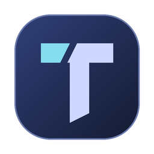

<p align="center">
  
</p>

<h1 align="center">Toren IDE</h1>
<p align="center">Your local workspace for modern .NET.</p>

<p align="center">
  <a href="https://github.com/owlCoder/toren-ide/actions/workflows/ci.yml"></a>
  <a href="https://github.com/owlCoder/toren-ide/actions/workflows/package.yml"></a>
  <a href="LICENSE"></a>
</p>

Toren is an open-source desktop IDE for C# and ASP.NET Core on **Windows, macOS and Linux**. It works with standard .NET solutions and projects, uses the tools already installed on your machine, and keeps your workspace local. No Toren account, mandatory cloud service or mandatory telemetry is required.

[Releases](https://github.com/owlCoder/toren-ide/releases) · [Feature status](docs/progress.md) · [Roadmap](docs/roadmap.md) · [Contributing](CONTRIBUTING.md)

## What you can do

| Area | Available workflows |
| --- | --- |
| Workspace and editor | Open folders, `.sln`, `.slnx` and `.csproj`; Explorer, tabs, find/replace, quick open, workspace search and session recovery |
| C# tools | Roslyn-backed completion, diagnostics, hover information, definition navigation, formatting, rename and quick fixes |
| Build and run | Restore, Build, Rebuild, Clean, Run and Publish; configuration/startup selection, cancellation, progress and navigable Problems |
| Debug and test | Debugger sidebar with stepping, breakpoints, variables and console; test discovery/execution with NUnit, xUnit, MSTest and Microsoft Testing Platform compatibility |
| Source and packages | Git source-control sidebar and NuGet package management in a dedicated dialog |
| Web and data tools | ASP.NET Core launch profiles, HTTP requests, EF Core migrations and optional Docker Compose workflows |
| Desktop experience | Dark/light themes, Toren icons, adjustable panels, a separate Settings dialog, Environment Doctor and an integrated terminal with process controls |

Some capabilities remain partial. The [feature matrix](docs/progress.md) tracks their exact scope, and the [UI review](docs/design/ui-review.md) records visual coverage.

## Download and run

Binary packages are prepared as **self-contained builds** with the .NET 10 runtime included. You can launch Toren without installing a separate .NET runtime; developing a project still requires its .NET SDK.

The first candidate, **`1.0.0-preview.1`**, is being prepared as an **unpublished Draft release**. Drafts are visible to repository maintainers, and are not public downloads. Public distribution remains pending Apple signing/notarization and final validation of the exact release packages. The [Releases page](https://github.com/owlCoder/toren-ide/releases) will contain public downloads after those gates pass.

Choose the archive for your machine:

| Platform | Package | Launch |
| --- | --- | --- |
| Windows x64 | `Toren-IDE-win-x64.zip` | Extract the full ZIP and run `Toren.App.exe` |
| Linux x64 | `Toren-IDE-linux-x64.tar.gz` | Extract the full archive and run `./Toren.App` |
| macOS Apple Silicon | `Toren-IDE-osx-arm64.zip` | Extract and move `Toren IDE.app` to Applications |
| macOS Intel | `Toren-IDE-osx-x64.zip` | Extract and move `Toren IDE.app` to Applications |

Keep all extracted files together. Each archive contains launch instructions, the Apache license and `release-info.json` identifying its version, architecture and source commit. SHA-256 checksum files accompany the archives.

Linux requires its native desktop/runtime dependencies; see the [Avalonia Linux deployment guide](https://docs.avaloniaui.net/docs/deployment/linux). Candidate macOS bundles from CI and Draft releases have **not** received Developer ID signing or notarization. They are maintainer validation artifacts; public macOS downloads must pass the [signing process](docs/release/macos-signing.md).

Packages currently cover Windows/Linux x64 and both Mac architectures. Installers, Windows/Linux ARM64 builds and an automatic updater are not included.

## Open your first workspace

1. Install the .NET SDK required by your project and its `global.json`. Install Git for source-control tools.
2. Start Toren and use **Open** in the command bar to choose a folder, solution or project.
3. Select the build configuration and startup project, then restore/build/run from the command bar.
4. Check **Output** and **Problems** for build results. Open **Doctor** to inspect missing tools and environment issues.

Settings opens in a separate dialog. Source Control, Debug and HTTP use the sidebar; Output, ASP.NET, Doctor and Terminal use the bottom panel. Opening the Terminal tab starts a terminal session, which can be stopped from its controls.

Docker Compose and `dotnet ef` are optional; install them when you need the corresponding tools. Toren keeps ordinary .NET projects compatible with Visual Studio, Rider, VS Code and the `dotnet` CLI.

## Project status

**MVP 1.0 is under active development.** M0–M8 are implemented; M9 release hardening is in progress. Cross-platform source builds, automated tests, compatibility checks and release contracts run in [CI](https://github.com/owlCoder/toren-ide/actions/workflows/ci.yml).

The macOS development review includes native interaction checks and dark/light UI captures. Final hands-on Windows/macOS/Linux smoke, visual, accessibility and performance checks must still run against the exact promoted release archives. Passing source tests or packaging does not certify those gates.

Large workspaces remain an area of active work. In the 220-project Orchard Core review, opening the solution through the application's own composition populated the startup-project selector in about two seconds and showed the first workspace diagnostics in about twelve; those runs were headless, so rendering and input latency in a native window still need a hands-on pass. See the [performance report](docs/design/performance-review.md) for measurements, hardware and limits.

## Build from source

You need a compatible **.NET 10 SDK**, Git and the native dependencies required by Avalonia on your operating system. `global.json` allows compatible .NET 10 feature bands.

```bash
git clone https://github.com/owlCoder/toren-ide.git
cd toren-ide
dotnet restore Toren.slnx
dotnet build Toren.slnx --configuration Release --no-restore
dotnet run --project src/Toren.App/Toren.App.csproj --configuration Release
```

Run the automated tests:

```bash
dotnet test Toren.slnx --configuration Release
```

Maintainers can create the four archive types with [Package](https://github.com/owlCoder/toren-ide/actions/workflows/package.yml), then prepare an unpublished download draft with [Draft Release](https://github.com/owlCoder/toren-ide/actions/workflows/draft-release.yml). The [publishing guide](docs/release/publishing.md) describes immutable tags, checksums, signing, validation and public publication.

## Inside the repository

Toren uses **C# 14, .NET 10, Avalonia, AvaloniaEdit and Roslyn**, with standard CLI/MSBuild tooling and a DAP-compatible debugging boundary.

```text
src/                 Desktop app, core contracts and feature modules
tests/               Automated tests and UI regression coverage
scripts/             Release checks, signing and performance probe
docs/                Product, architecture, design and release documentation
.github/workflows/   Cross-platform CI, packaging and release workflows
```

Modules keep platform adapters and process handling behind contracts; expected operational failures use explicit result types. Toren does not introduce a proprietary project format.

## Documentation and contributions

- [Product scope](docs/product-specification.md) and [delivery roadmap](docs/roadmap.md)
- [Implementation status](docs/progress.md)
- [UI principles](docs/design/ui-principles.md) and [visual review](docs/design/ui-review.md)
- [Architecture decisions](docs/decisions/) and [maintainability guidelines](docs/engineering/maintainability.md)
- [Release checklist](docs/release/checklist.md) and [publishing guide](docs/release/publishing.md)

Read [CONTRIBUTING.md](CONTRIBUTING.md) before submitting changes. Bug reports are most useful with the OS, Toren version, workspace type, steps to reproduce and relevant Output/Doctor details. Do not include credentials or private project content.

## License

[Apache License 2.0](LICENSE).
